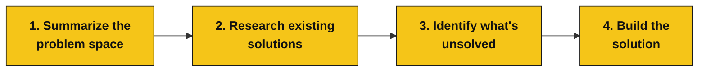

# Design Thinking for Vibe Coders
[vibecoders.global](https://vibecoders.global/)

Private, bespoke AI trainings for teams. Give your whole team an engineer's superpowers!


[Book a free discovery call](https://calendar.google.com/calendar/u/0/appointments/schedules/AcZssZ2m-AxM9LTpiQBEeQcDN4UW-vqTGJhlcYVNbSPnqIi3R_o0Y12bPsnQeBdm4BE3uwqPjLbyBboY)

---

A simple, repeatable way to go from *"this everyday thing annoys me"* to a working app — using an AI chat assistant and five copy-paste prompts. No coding or technical background needed.

Each step is just one conversation with an AI. You paste in a prompt, save what it gives back, and carry it into the next step.

## The process at a glance



## What you'll need

- **A problem you or your teammate cares about**, plus a quick fishbone diagram of it. *(A fishbone diagram is a simple sketch: your problem sits on the right, and the possible causes branch off it like the bones of a fish — an easy way to lay out everything feeding into it.)*
- **An AI chat assistant** (such as Claude or ChatGPT).
- **A vibe-coding tool** — anything that turns a written description into a working app (Claude code, Google AI Studio, Lovable, v0, Bolt, etc.)
- **40 mins**

A note on chats: some steps say *start a new chat*. That's on purpose — a fresh chat keeps the AI from getting anchored on earlier back-and-forth, so each stage starts clean.

---

## Step 1 — Summarize the problem space

You start with a messy pile of thoughts. This step turns them into a clear, structured summary you'll build on for the rest of the process. Feed in your fishbone diagram; the AI hands back a tidy **problem-space summary**.

**Prompt:**

```
I'm designing a digital product.

It's been too hot in London, so I wanted to solve that. I made a
fishbone diagram, which you can see attached.

Based on it, generate a problem-space summary.

[attach your fishbone diagram]
```

> Swap the "too hot in London" line for whatever problem you're tackling.

**Then:** save the problem-space summary it gives you. You'll reuse it in Steps 2 and 3.

---

## Step 2 — Research existing solutions

Before building anything, see what already exists. The AI searches online for the most effective things people have already made, then boils them down into one summary.

> **Start a new chat.** Paste in the problem-space summary from Step 1.

**Prompt:**

```
I'm designing a digital product.

Below is a summary of the problem space.

Research online to find existing solutions to any of the problems
described, aiming for a final 15 of the most effective.

[paste your problem-space summary here]
```

Once it lists the 15, ask it to condense them — **in the same chat:**

```
Write an Existing-Solutions Summary that is 1 long paragraph.
```

**Then:** save the existing-solutions summary too.

---

## Step 3 — Identify what's unsolved

Now find the gap — the thing nobody has solved well yet. The AI looks at the problem space *and* what already exists, then proposes three fresh ideas aimed at what's still missing. You pick your favorite.

> **Start a new, fresh chat.** Paste in both summaries.

**Prompt:**

```
I'm designing a digital product.

Below is a summary of the problem space.

I want to create my own solution, addressing something still unsolved.

Propose a list of 3 such solutions.

[paste your problem-space summary here]
[paste your existing-solutions summary here]
```

**Then:** pick the one of the three you like best.

---

## Step 4 — Build the solution

Turn your chosen idea into a detailed brief a vibe-coding tool can build from — written in plain, customer-focused language, with no tech jargon.

> **Stay in the same chat** as Step 3.

**Prompt:**

```
For [the solution you chose], write a thorough, detailed prompt I can
give to a vibe coding tool so that it builds this app for me. Do not
make any suggestions about technologies used. Instead, describe the app
via a high-level design brief from the customer perspective.
```

**Then:** copy the brief it writes, paste it into your vibe-coding tool, and let it build.

---

That's the whole loop. Run it again any time something bugs you — every annoyance is a candidate for your next app.
---

## Useful links

[NNG Knowledge Base on Research](https://www.nngroup.com/articles/)


[Making the Invisible Visible](https://www.strategyxdesign.co.uk/tools-for-thinking/)


[Making the Invisible Visible](https://www.strategyxdesign.co.uk/tools-for-thinking/)


[How to explain your AI system to your users](https://pair.withgoogle.com/guidebook/patterns)


<sub>From the Vibe Coding Collective · vibecoders.global</sub>
